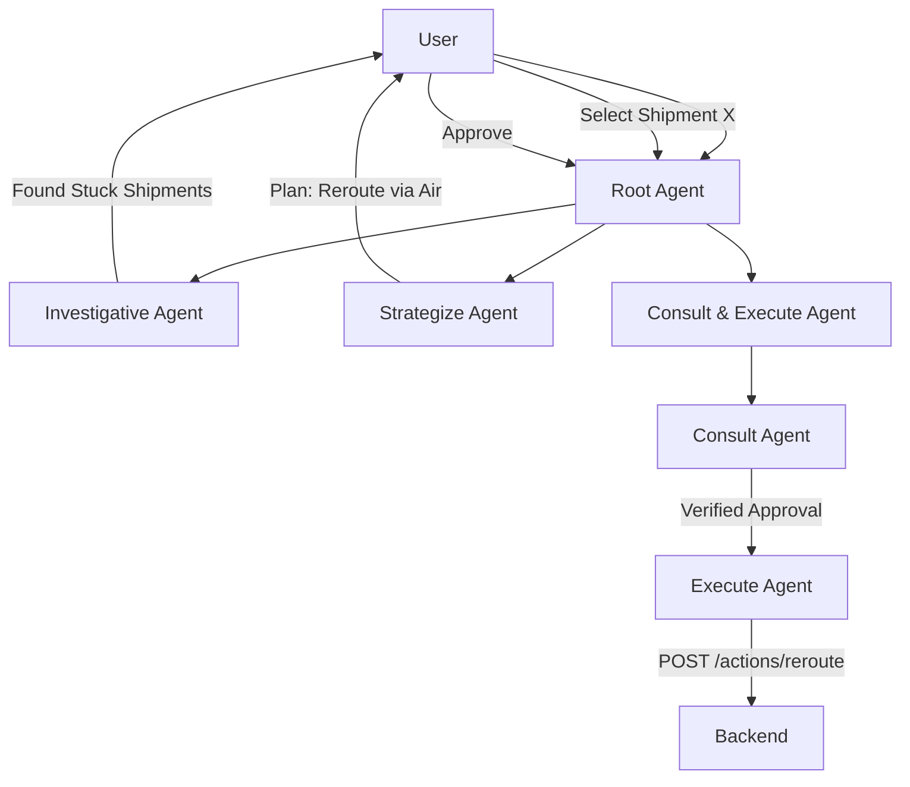

# Supply Guardian: Crisis Agent Architecture

## Overview
The **Supply Chain Crisis Agent** is a specialized autonomous agent designed to identify, analyze, and resolve supply chain disruptions in the Supply Guardian simulation. It acts as an intelligent operator that can autonomously navigate the backend API to rescue stuck shipments.

## Architecture

The system uses a **Hierarchical Team** pattern orchestrated by a root agent (`supply_chain_crisis_agent`). This root agent manages specialized sub-agents, each with a distinct responsibility in the resolution pipeline.

### root_agent: `supply_chain_crisis_agent`
- **Role**: Conductor / Orchestrator.
- **Goal**: Manage the end-to-end lifecycle of a supply chain crisis resolution.
- **SOP (Standard Operating Procedure)**:
    1.  **Investigate**: Identify the problem.
    2.  **Wait**: Ensure user selection.
    3.  **Strategize**: Formulate a plan.
    4.  **Execute**: Verify approval and action the plan.
    5.  **Map Control**: Throughout the process, the agent autonomously updates the dashboard map to focus on relevant items.

---

## Sub-Agents

### 1. Investigative Agent (`investigative_agent`)
- **Role**: Detective.
- **Goal**: Identify active "Stuck" shipments and contextualize them with product importance.
- **Tools**:
    - `get_stuck_shipments()`: Fetches shipments with status='Stuck'.
    - `get_products()`: Retrieves product catalog (values, priority).
- **Process**:
    - Scans the network for stuck items.
    - Enriches shipment data with product metadata (high-value vs. low-value).
    - Presents a prioritized list to the user.

### 2. Strategize Agent (`strategize_agent`)
- **Role**: Logistics Planner.
- **Goal**: Formulate the optimal rerouting strategy for a specific shipment.
- **Tools**:
    - `get_disruption_context()`: Checks for active network blockers (e.g., strikes, weather).
    - `get_action_quotes(shipment_id)`: Fetches valid reroute options from the backend logic.
    - `get_products()`: Used for value-at-risk analysis.
- **Process**:
    - Analyzes active network disruptions.
    - Evaluates available quotes (Time vs. Cost trade-offs).
    - Recommendations are context-aware (e.g., "Air freight is expensive but necessary for these perishable goods").

### 3. Consult & Execute Agent (`consult_and_execute_agent`)
- **Type**: `SequentialAgent` (Pipelines two sub-agents).
- **Goal**: Ensure human-in-the-loop safety before modifying state.

#### A. Consult Agent (`consult_agent`)
- **Role**: Compliance Officer.
- **Goal**: Verify user consent.
- **Logic**:
    - Analyzes conversation history.
    - Returns `APPROVED` if explicit consent ("Yes", "Go ahead") is found.
    - Returns `PENDING` otherwise.

#### B. Execute Agent (`execute_agent`)
- **Role**: Operator.
- **Goal**: Apply the fix.
- **Tools**:
    - `apply_reroute(shipment_id, new_route_id)`: POSTs the decision to the backend.
- **Logic**:
    - **IF** `consult_agent` confirmed `APPROVED`: Calls the API to reroute.
    - **IF** `PENDING`: Stops and requests user confirmation.

## Integration Points
The agents interact with the backend via `tools.py`, which wraps REST API endpoints:
- `GET /shipments?status=Stuck`: Source of work.
- `GET /network/disruptions`: Context for decision making.
- `GET /actions/quotes/{id}`: Solution space.
- `POST /actions/reroute`: Action execution.

## Map Control Protocol
The agents use a special token protocol to control the frontend map view. This allows the agent to "point" at things during the conversation.

**Token Format:** `[VIEW: JSON_DATA]`

**Supported Patterns:**
1.  **Focus Shipment**: `[VIEW: {"target_id": "SH-1002"}]`
    *   Zooms to the shipment's current coordinates.
2.  **Focus Node**: `[VIEW: {"target_id": "PORT-NYC"}]`
    *   Zooms to the port/warehouse location.
3.  **Focus Region**: `[VIEW: {"lat": 34.05, "lng": -118.2, "zoom": 8}]`
    *   Pans and zooms to arbitrary coordinates.

## Flow Diagram

